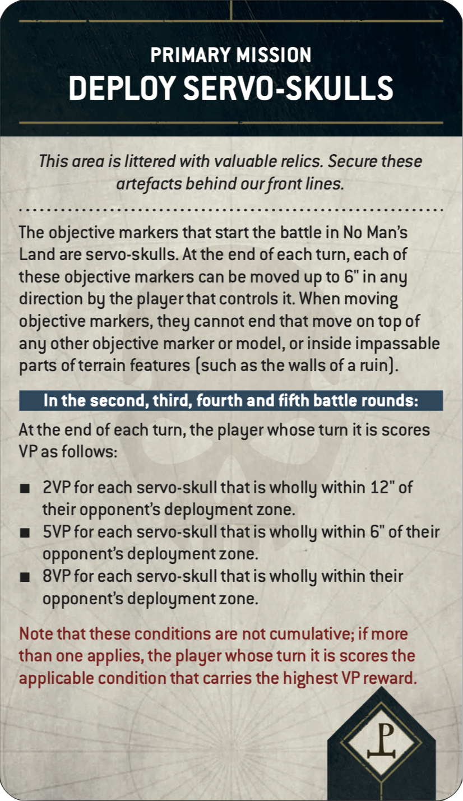
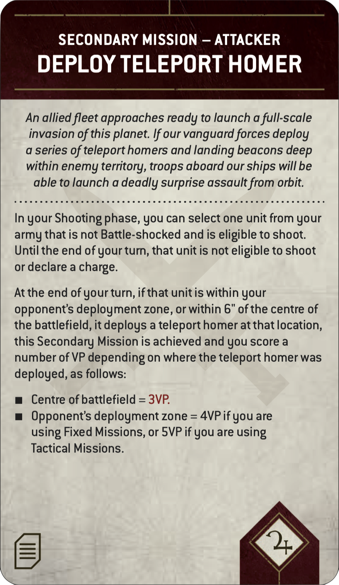
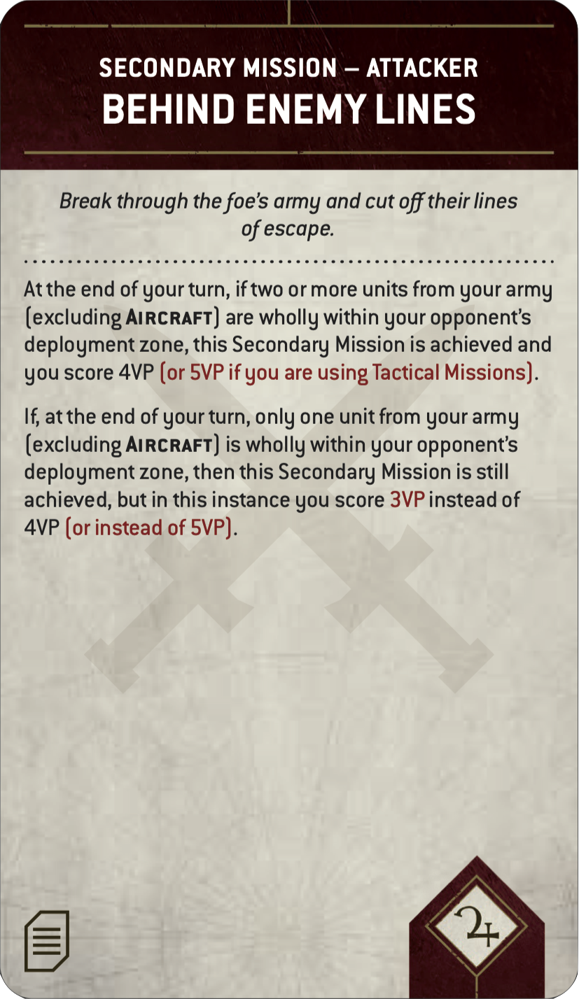
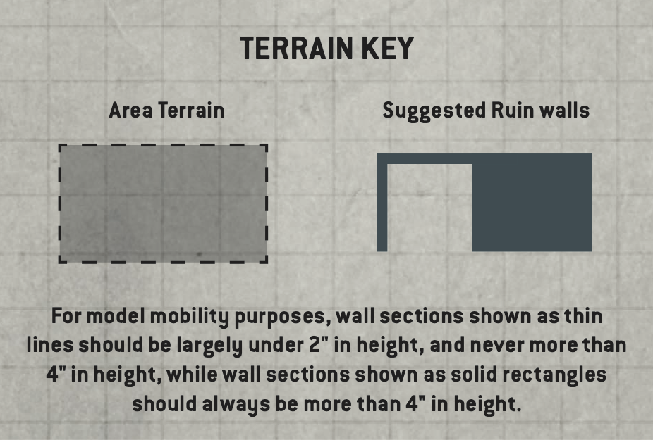

# LEVIATHAN TOURNAMENT COMPANION

VERSION 1.0

## INTRODUCTION

Welcome to the Leviathan Tournament Companion! The following guidelines are designed to support organisers of Warhammer 40,000 events in delivering a fine-tuned tournament experience using the *Leviathan Mission Pack*. That product offers unprecedented scope for all kinds of matched play, and its many variables create a dizzying array of potential missions -- thousands, in fact! Some of these are particularly well suited to the most hotly contested scenarios, and this pack provides suggestions for the best event configurations. We have also taken the opportunity to optimise certain Core Rules concepts for tournament play.

This document provides a ready-made framework for levelling the playing field and getting games underway quickly, whether you are planning your first matched play event or have years of experience organising the largest and most acclaimed tournaments. Its recommendations will be followed in full at most Games Workshop matched play events, and are considered the official way to play Warhammer 40,000 in a tournament setting, but can be adapted to suit your own circumstances -- the terrain layout advice is aimed primarily at newer organisers, for example, and those with large established terrain collections should feel free to interpret it accordingly.

The recommendations are presented as follows:

- **Leviathan Tournament Mission Sequence:** Adjustments to the steps players would normally follow to generate a mission and prepare the battlefield.  
- **Leviathan Card Updates:** Tweaks to certain cards in the     *Leviathan Mission Pack*.
- **Leviathan Tournament Mission Pool:** 15 recommended tournament rounds to draw from, with pre-set Primary Missions, Mission Rules and deployment modes that put all players on an equal footing and minimise pre-game admin.
- **Terrain Layouts:** A suite of carefully designed terrain setups to be used in conjunction with the Leviathan Tournament Mission Pool.
- **Pairings and Rankings:** Advice for fairly pairing players and determining rankings.

## LEVIATHAN TOURNAMENT MISSION SEQUENCE

Players should use the mission sequence presented in the *Leviathan Mission Pack*, but replace steps 2, 4 and 5 with those shown below.

### 2 DETERMINE MISSION

Instead of shuffling and drawing from the Deployment, Mission Rule and Primary Mission decks, players should use the pre-generated missions from the Leviathan Tournament Mission Pool. Set aside the Secondary Mission and Gambit decks as normal (players will receive these later).

### 4 PLACE OBJECTIVE MARKERS

Players now set up objective markers on the battlefield. Each Deployment card's deployment map will show players how many objective markers to set up and where each should be placed. In Leviathan Tournament Missions, models can end any type of move on top of an objective marker.

> **Designer's Note:** *In the Warhammer 40,000 Core Rules, objective markers are physical artefacts that models cannot end a move on,representing vital data caches, xenos relics, Chaos portals or anything else that suits your narrative. While this adds to the cinematic nature of the battlefield and offers exciting hobby opportunities, it can sometimes result in model-positioning circumstances that not everyone will enjoy equally. As such, these guidelines recommend treating objective markers as flat, circular markers 40mm in diameter that offer no impediment to the movement or placement of models.*

### 5 CREATE THE BATTLEFIELD

Players now create the battlefield and set up terrain features. Missions are played on rectangular battlefields whose dimensions are approximately 44" by 60".

When setting up terrain features, use the guidelines detailed in the Terrain Layouts section of this pack. Players must use the rules for terrain features detailed in the Core Rules. While other approaches to terrain layout may work within the collections of experienced organisers, we recommend these terrain guidelines when otherwise in doubt.

> **Reminder:** *During the Select Secondary Missions step, if a player decides to use Tactical Missions, note that the two Secondary Mission cards they place face down and then reveal to their opponent should be returned to their Secondary Mission deck before they reshuffle it (they are not placed to one side or discarded). Before drawing cards in tournament play, it is always good practice to offer your opponent the opportunity to cut your deck.*

## LEVIATHAN CARD UPDATES

When using the *Leviathan Mission Pack*, use the updated cards presented on this page in place of their printed equivalents. Note that both the Attacker and Defender should use the text presented on the Attacker cards shown below. Updated text is shown in red.

{: width="33%"}
{: width="33%"}
{: width="33%"}

## LEVIATHAN TOURNAMENT MISSION POOL

**The 15 Leviathan Tournament Missions in this section are designed to act as a pool from which organisers can build their events, selecting from it in random order. Further commentary on these is given below.**

### *Primary Missions*

Every Primary Mission from the *Leviathan Mission Pack* is included in this mission pool. If you are running an event with only 3-6 rounds, we recommend selecting options that span a variety of different Primary Missions. For example, if running a 3-round Saturday tournament, you might use missions A, B, and C, or D, F, and G.

For those running longer-format events, or whose attendees are particularly expectant of a perfectly balanced mission every time, we have included the more straightforward Primary Missions in a greater number of configurations.

### *Mission Rules*

Mission Rules are an exciting component of the *Leviathan Mission Pack*, providing twists to the way a mission is normally played, and the ones recommended here are particularly suited to tournament play. For the Leviathan season of play, we recommend using Chilling Rain (i.e. no effect), Hidden Supplies, Chosen Battlefield and Scrambler Fields, as shown in the configurations below.

### *Terrain Layouts*

When using the recommended terrain layouts in this pack, please note the layouts best suited for each deployment mode, as shown in the table below. We recommend structuring your mission order to facilitate any changes to terrain layouts you will need to make during your event.

|   | PRIMARY MISSION | MISSION RULE | DEPLOYMENT | TERRAIN LAYOUTS
|---|---|---|---|---
| A | Take and Hold | Chilling Rain | Search and Destroy | 1, 3, 4
| B | Priority Targets | Hidden Supplies | Search and Destroy | 1, 3, 4
| C | The Ritual | Scrambler Fields | Sweeping Engagement | 1, 2, 3, 4
| D | Deploy Servo-skulls | Chilling Rain | Search and Destroy | 1, 3, 4
| E | Take and Hold | Chosen Battlefield | Sweeping Engagement | 1, 2, 3, 4
| F | Supply Drop | Chilling Rain | Search and Destroy | 1, 3, 4
| G | Sites of Power | Chilling Rain | Hammer and Anvil | 1, 2, 4
| H | The Ritual | Chilling Rain | Hammer and Anvil | 1, 2, 4
| I | Take and Hold | Hidden Supplies | Hammer and Anvil | 1, 2, 4
| J | Priority Targets | Chilling Rain | Crucible of Battle | 1, 3, 4
| K | Deploy Servo-skulls | Hidden Supplies | Crucible of Battle | 1, 3, 4
| L | Scorched Earth | Chilling Rain | Dawn of War | 1, 2, 3
| M | Purge the Foe | Chilling Rain | Crucible of Battle | 1, 3, 4
| N | Priority Targets | Chosen Battlefield | Dawn of War | 1, 2, 3
| O | Vital Ground | Chilling Rain | Crucible of Battle | 1, 3, 4

## TERRAIN LAYOUTS

**The following battlefield recommendations are intended primarily for newer organisers and those looking for a steer in building up a terrain collection for regular tournament play. These layouts will be seen at most Games Workshop matched play events, and reflect the type of terrain density that creates risk-and-reward decisions that a wide variety of army types can engage with. They are by no means the only way to set up a battlefield for balanced play, but represent a reliable starting point when in doubt.**

These layouts were designed with a few key principles in mind:

### NO FIXED MEASUREMENTS

Precisely locked terrain layouts with fixed measurements are not recommended. As well as limiting the variety of terrain organisers may feel permitted to field, such strictures can encourage army construction that plans for guaranteed measurements for the purposes of line of sight, objective control and so on. Furthermore, it can create problematic mid-game situations should players notice their terrain does not meet prescribed limits. When using these layouts, players should ensure they are as close to the illustrated positions as possible, but organisers should avoid mandating precise locations for each piece.

In general, however, there should be at least 4" between the physical edges of each terrain feature. This is primarily to avoid situations where certain factions (e.g. Imperial Knights) are unable to interact with areas of the battlefield due to Ruins and other impediments being too close together.

### OBJECTIVE MARKERS

Objective markers can and sometimes will be either hidden within terrain or placed in the open, but the markers themselves should never intersect a wall or similar element.

### USE OF RUINS

The following layouts primarily use the Ruins terrain feature. This efficiently achieves a good amount of line-of-sight blockage and cover appropriate for balanced games, thanks to the natural abstraction of line of sight within the rules for Ruins. Remember that a variety of terrain heights not only adds to the immersive nature of the battlefield, but is also important for line of sight and rules such as Plunging Fire. For organisers and players with a more robust terrain collection (especially elements that block true line of sight), incorporating features such as Woods, Barricades and Hills into your chosen layouts is perfectly acceptable.

{: width="33%"}

## PAIRINGS AND RANKINGS

There are countless different ways in which a Warhammer organised play event can be run. While broad-stroke concepts like pairing off players with the same record are straightforward enough, the nuance of running a successful Warhammer tournament is the subject of continuous conversation and evolution. The following recommendations are once again for newer organisers who are still establishing their principles and best practices, to help improve the average experience at any Warhammer tournament. These principles are also followed at most official Games Workshop events, and are designed to create the fairest, most fun experience possible for every attendee, regardless of standing.

### PAIRING PLAYERS

While the first round of most tournaments is randomly paired, subsequent round pairing can be done in a number of ways. The first pairing metric will almost always be player record, i.e. pairing a 3-1 player with another 3-1 player, and so on. Given that most rounds will include numerous players with the same record, however, deciding pairings beyond this metric can be quite nuanced, and the different methods available can have significant impacts on the experience of players at an event. We recommend pairing players by the following criteria:

- **First** - by record (i.e. the number of wins, losses and draws)
- **Second** - by win path (i.e. the timing of the rounds in which a
    player won or lost their games)
- **Third** - randomly within players of the same ranking

#### *Win Path*

A player's 'win path' refers not to their number of wins and losses, but to the timing of those wins and losses. While pairing by win path has an incidental tendency to pair people by strength of schedule, its greatest impact is on the overall enjoyment experienced by all players, as it tends to pair players based upon shared experience.

For example, let's take two 3-1 players. One of them lost their first game; they likely lowered their expectations for winning the whole event after this, but are probably in a great mood after three consecutive victories. The other won their first three games then lost their fourth -- a sharp disappointment after a 3-0 start. Should these players face off, their shared enjoyment may be at odds as they are in very different emotional places. Win path ensures players enter their match with recent common experiences upon which to build a friendship during their next game of Warhammer.

### RANKING PLAYERS

In many tournaments, the overall Best General will be the single remaining undefeated player at the end of the event. Sometimes, however, there are not enough rounds available to determine a single undefeated player, and players often wish to know their ranking regardless of whether they won the whole event. To help break ties between players who end an event with the same record, we recommend ranking players by the following criteria:

- **First** - by overall record (wins, losses and draws)
- **Second** - by their opponents' win records (i.e. those with more wins against opponents with better win records would place higher)
- **Third** - by total Victory points (VP)

> **Designer's Note:** *Traditionally, many organisers use total VP or VP differential to determine ranking. However, the number of VP scored within any one game of Warhammer 40,000 rarely tells a clear story about how close that game actually was. Often, a more challenging opponent will be harder to score against (and thus yield a lower score despite the victory being all the more hard-earned), or the nature of how the two armies match up may dictate a risky strategy that doesn't pay off (and thus yield a wide score disparity despite almost working out).*
>
>*As such, we do not recommend using VP as a pairing metric, nor as a ranking metric until all other metrics have been exhausted, or when further tie-breaking is required (e.g. in larger events where identical rankings become more likely). By contrast, opponent win record is an ideal metric, because when two players end up with the same record, the overall skill of their opponents is a better indicator of which player had the more challenging path along the way.*

#### *The Rules Commentary*

There are myriad ways to enjoy the Warhammer hobby, and these all manifest themselves at a tournament: gifted hobbyists with beautiful armies, skilled competitors aiming for Best General, casual players looking to face new opponents and make new friends (by far the most common type of attendee), and even practitioners of the niche hobby of Rules Lawyer! These particular hobbyists often find unusual rules interactions at the very fringes of Warhammer 40,000, which can create interesting challenges for tournament organisers looking to provide clear answers and an easy gaming experience for their attendees. For the current edition, the Warhammer Design Studio has created its most robust and comprehensive Rules Commentary to date. Available to download on *warhammer-community.com*, this living document will be reviewed periodically to clarify any issues that may be causing uncertainty. Should an odd rules interaction come up during your event and the Core Rules do not provide a clear answer, we recommend consulting the Rules Commentary.

## AFTERWORD

**WHAT IS THE POINT OF A WARHAMMER TOURNAMENT?**

Warhammer is more popular than ever, and this popularity has extended to the tournament scene. Over the last few years, more than one million games of Warhammer 40,000 were played in tournaments around the world, and that growth will only continue in the future. With so many Warhammer hobbyists participating in the game within growing communities, it's important to ruminate on the point of a tournament. First and foremost, it is not about celebrating the ultimate victor; someone who goes undefeated and wins Best General needs very little acclaim beyond the outcome itself (after all, they won!). Instead, it is the experience of every single attendee that truly matters, and the recognition that, for most people who attend a tournament, community and friendship are both the purpose and the outcome.

Before you roll a single dice against an opponent to start your tournament experience, remember two things:

1. The person across the table from you shares your love of Warhammer.
2. By the time the dust settles on the event, almost everyone will have lost a game (typically, at most, only one or two people will manage to leave the event without a loss).

While any game often yields winners and losers on the tabletop, the magic of Warhammer in an event setting is the opportunity it provides every participant to become a bigger part of the Warhammer community, and to build friendships with fellow hobbyists that can last a lifetime. As an organiser or a player, if you focus on this inalienable truth, then while most of you will have lost a game or two, you'll all share victory in your experience of what it is to attend a Warhammer event.

*- The Warhammer Events Team and the Warhammer Design Studio*
